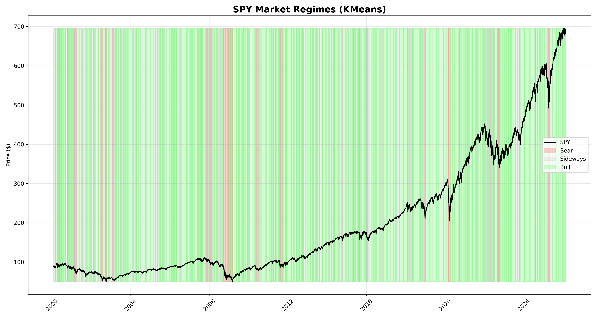

# 🚀 Market Regime Detection System
**hisham_hajaz | Feb 2026**

KMeans clustering detects **Bull/Bear/Sideways** regimes in SPY (2000-2026)

## 📊 Results
- **Bear (Red):** 14% - High volatility + negative returns
- **Sideways (Gray):** 55% - Low volatility + flat returns
- **Bull (Green):** 31% - Low volatility + positive returns

